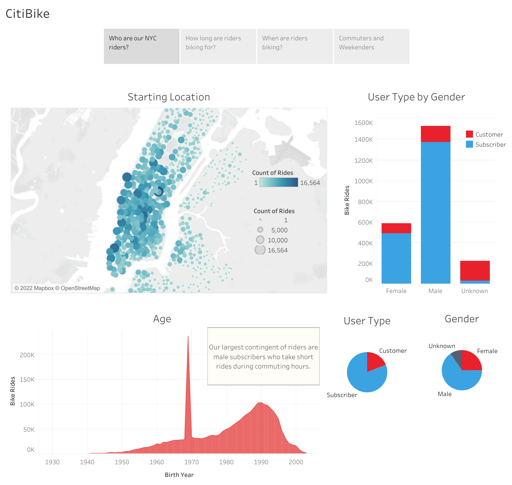
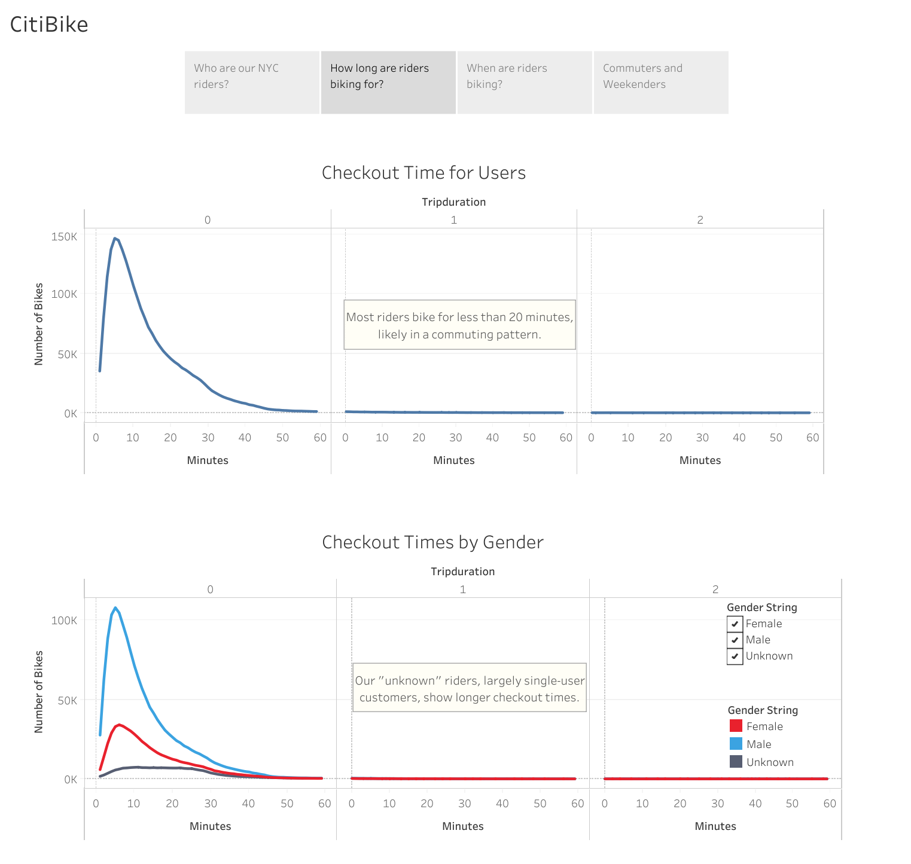
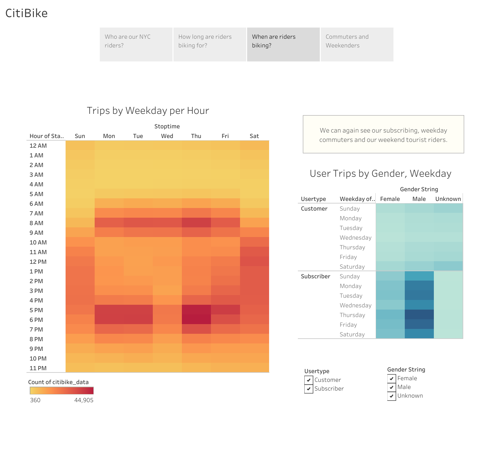
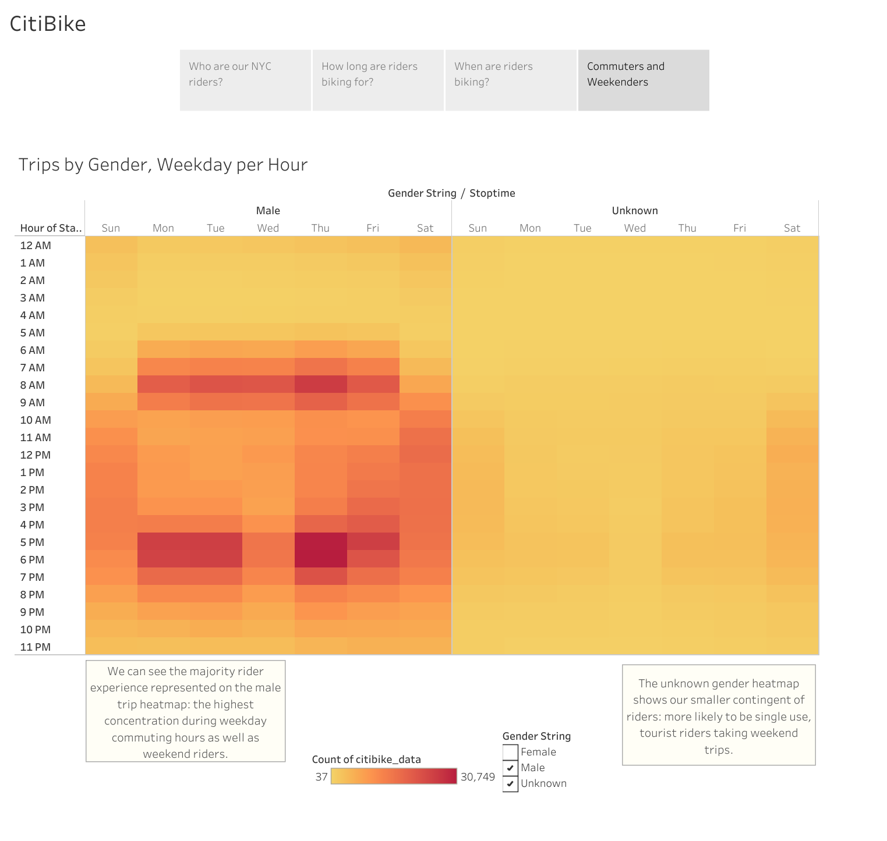

# Bikesharing Analysis

## Overview

### Purpose
This analysis provides insights from one month of NYC Citibike data for a business looking into bikesharing in another location. Areas for analysis include rider demographics, checkout lengths, and rides by weekday and hour. 

### Tools
* Talbeau Public
* Pandas 

## Results

### Who are our NYC riders?

### How long are riders biking for?

### When are riders biking?

### Commuters and Weekenders

### Tableau Public Link
Find the interactive story here: [CitiBike Story](https://public.tableau.com/app/profile/sarah.gallagher6694/viz/CitiBikeStory_16532014288480/CitiBike?publish=yes). 

## Summary 

The pattern of commuting subscribers and weekend one time users emerged from this analysis. Subscribers are the majority of NYC Citibike users; they typically bike for less than 20 minutes, most often during commuting hours but also during the weekends, and are mostly male. Weekenders are typically non-subscribing customers who bike for between 10 and 40 minutes and for whom we have less data (i.e. "unknown" gender).

The majority of riders are recurring subscribers, so further analysis could include looking more deeply into their patterns of use (by location, how often commuters use bikes for other purposes). Directions from this insight can include optimizing the commuting experience as well as increasing weekender or other uses. 

In terms of demographics, we also see that the majority of riders are male; further analysis could also explore user data along gender lines with the aim of increasing use and improving experience for female riders. 
